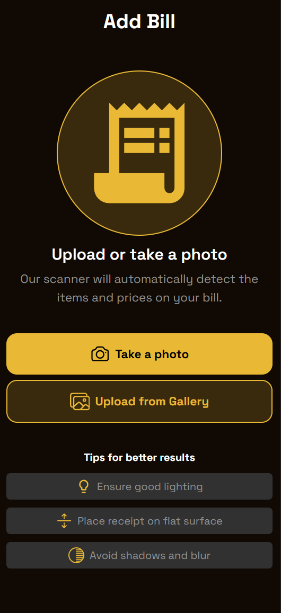
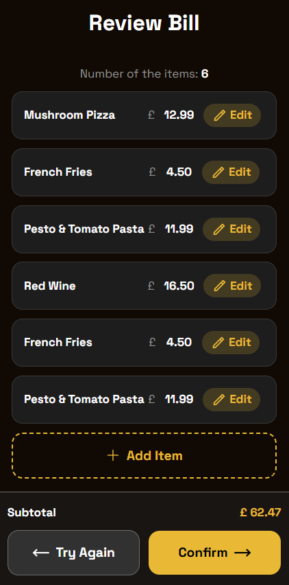

# Bill Splitter

## UploadPhoto Component

### Location

- `components/UploadPhoto.tsx`

### Purpose

`UploadPhoto` is the bill image intake component. It lets users either:

- take a new photo from the device camera, or
- upload an existing image from the gallery/files.

After image selection, it sends the image to the extraction API and returns structured bill data to the parent component.

### Props

| Prop | Type | Required | Description |
|------|------|----------|-------------|
| `onSuccess` | `(bill: ExtractedBill) => void` | Yes | Called when extraction succeeds, with parsed bill payload. |

### Internal State

| State | Type | Initial value | Description |
|-------|------|---------------|-------------|
| `isLoading` | `boolean` | `false` | Tracks active upload/extraction request and switches the UI to a dedicated loading component. |
| `error` | `string \| null` | `null` | Stores upload/extraction error message for user feedback. |

### User Flow

1. User chooses an image from either camera or gallery input.
2. `handleFileChange` reads the first selected file from `event.target.files?.[0]`.
3. If a file exists, `handleImageUpload(file)` runs.
4. A `FormData` object is created with key `image`.
5. Component sends `POST /api/extract` with multipart form data.
6. On success (`response.ok === true`), response JSON is parsed as `ExtractedBill` and passed to `onSuccess`.
7. On failure, component extracts `errorData.error` when available, otherwise uses fallback message.
8. `isLoading` is reset in `finally`, ensuring UI recovers in both success and error cases.

### API Contract Used

- Endpoint: `POST /api/extract`
- Request body: `FormData` with `image: File`
- Success response: JSON matching `ExtractedBill`
- Error response: JSON optionally containing `error` string

### Loading Behavior

- While `isLoading` is `true`, `UploadPhoto` returns `ReviewBillLoading` from `components/loadings/ReviewBillLoading`.
- During this state, the upload form UI is not rendered; users see only the loading screen.
- `isLoading` is always reset in `finally`, so loading UI exits on both success and error.

### UI Structure

- Title area: "Add Bill"
- Visual cue: receipt icon (`MdReceiptLong`)
- Action buttons:
	- "Take a photo" (`accept="image/*"`, `capture="environment"`)
	- "Upload from Gallery" (`accept="image/*"`)
- Helper text and tips section with icons:
	- Ensure good lighting
	- Place receipt on flat surface
	- Avoid shadows and blur

### States Rendered

- Default: upload/take-photo actions are enabled.
- Loading (`isLoading === true`):
	- component renders `ReviewBillLoading`
	- upload form is replaced until request resolves.
- Error (`error !== null`):
	- message shown in red text with extracted/fallback error text.

## ReviewBill Component

### Location

- `components/ReviewBill.tsx`

### Purpose

`ReviewBill` is the bill validation and correction screen shown after OCR extraction. It allows users to:

- review detected items and prices,
- edit existing items,
- add new items,
- delete items,
- confirm the final bill, or
- restart extraction with "Try Again".

### Props

| Prop | Type | Required | Description |
|------|------|----------|-------------|
| `bill` | `ExtractedBill` | Yes | Initial extracted bill data to display and edit. |
| `onConfirm` | `(updatedBill: ExtractedBill) => void` | Yes | Called when user confirms the reviewed bill. |
| `onTryAgain` | `() => void` | Yes | Called when user wants to discard current review and re-upload/re-extract. |

### Internal State

| State | Type | Initial value | Description |
|-------|------|---------------|-------------|
| `billState` | `ExtractedBill` | `bill` prop | Local editable copy of the bill being reviewed. |
| `isItemModalOpen` | `boolean` | `false` | Controls visibility of item modal. |
| `selectedItem` | `BillItem \| null` | `null` | Stores current item being edited. |
| `modalMode` | `"edit" \| "add"` | `"edit"` | Determines modal behavior and action buttons. |
| `error` | `string \| null` | `null` | Temporary top alert used when confirm is attempted with no items. |

### Lifecycle Behavior

- A `useEffect` watcher syncs `billState` whenever the incoming `bill` prop changes.
- This ensures the review screen reflects newly extracted data if parent state updates.
- Another `useEffect` auto-clears `error` after 4 seconds and cleans up timeout on rerender/unmount.

### Derived Values

- `subtotal` is recalculated each render from `billState.items`:
  - reduce over all item prices
  - displayed with two decimals via `toFixed(2)`
  - shown with active bill currency.

### Item Management Handlers

1. `handleOpenEdit(item)`:
	- opens modal,
	- sets selected item,
	- switches mode to `edit`.
2. `handleOpenAdd()`:
	- clears selected item,
	- switches mode to `add`,
	- opens modal.
3. `handleSaveItem(updatedItem)`:
	- in `add` mode, appends a new item to `billState.items`.
	- in `edit` mode, updates matching item by `id`.
4. `handleDeleteItem(itemId)`:
	- removes item from `billState.items` by `id`.

### Modal Integration

`ReviewBill` renders `EditItemModal` (`components/modals/ItemModal.tsx`) conditionally when:

- modal is open, and
- either mode is `add` or an editable item exists.

Modal callbacks wired by parent:

- `onSave` -> `handleSaveItem`
- `onDelete` -> `handleDeleteItem`
- `onClose` -> closes modal and clears `selectedItem`.

### UI Structure

- Header: "Review Bill"
- Summary row: number of currently tracked items
- Item list cards:
  - item name
  - currency + price
  - Edit button
- Add Item action button
- Fixed bottom action menu:
  - subtotal display
  - Try Again button
  - Confirm button.

### User Actions and Outcomes

- Edit item: updates the matching `id` entry.
- Add item: creates a new item and expands list.
- Delete item: removes selected row from list.
- Try Again: triggers `onTryAgain()` without confirming local edits.
- Confirm:
	- if no items remain, sets error "The bill must have at least one item." and blocks continuation.
	- otherwise triggers `onConfirm(billState)` with latest reviewed/modified bill.

### Notes

- Item count and subtotal always reflect current `billState`.
- Confirm always sends the current local state, not the original `bill` prop.
- Currency label is rendered from `billState.currency` for consistency across rows and subtotal.
- Error alert is rendered in a fixed top banner with `role="alert"` and `aria-live="assertive"`.

## AddPeople Component

### Location

- `components/AddPeople.tsx`

### Purpose

`AddPeople` collects and manages the list of participants who will share the bill. It allows users to:

- add people by name,
- remove added people,
- review total participants,
- go back to the previous step, and
- continue only when at least two people are present.

### Props

| Prop | Type | Required | Description |
|------|------|----------|-------------|
| `getPeople` | `Person[]` | Yes | Initial list used to seed local participant state. |
| `onBack` | `() => void` | Yes | Navigates to the previous step. |
| `onNext` | `(people: Person[]) => void` | Yes | Called with current people list when validation passes. |

### Internal State

| State | Type | Initial value | Description |
|-------|------|---------------|-------------|
| `name` | `string` | `""` | Controlled value for the name input field. |
| `people` | `Person[]` | `getPeople` prop | Local editable list of added participants. |
| `error` | `string \| null` | `null` | Temporary alert message for validation/flow errors. |

### Color Assignment

- Component defines a fixed color palette:
	- `#E9B935`, `#359EE9`, `#E95335`, `#35E97B`, `#9B35E9`, `#E935A8`
- New people are assigned color by index rotation:
	- `colors[people.length % colors.length]`
- This keeps avatar colors distributed and reusable after palette length is exceeded.

### Validation Rules

`handleAddPerson(name)` enforces:

- name must not be empty after trimming
- name length must be 20 characters or fewer.

If validation fails, `error` is set and person creation is aborted.

`handleOnNext(people)` enforces:

- at least 2 people must exist before continuing.

If rule fails, an error is shown and `onNext` is not called.

### Error Message Behavior

- Errors are displayed in a fixed top alert container.
- Alert uses `role="alert"` and `aria-live="assertive"` for accessibility.
- A `useEffect` auto-clears `error` after 4 seconds.
- Existing timeout is cleaned up on effect re-run/unmount to avoid stale timers.

### Person Lifecycle

1. User types a name in controlled input.
2. Clicking Add calls `handleAddPerson(name)`.
3. On success, component creates a new `Person` object:
	 - `id`: `Date.now().toString()`
	 - `name`: entered value
	 - `color`: rotated value from palette
4. New person is appended to `people` state.
5. Input field is reset and previous error is cleared.
6. Delete action removes a person by `id` via `handleDeletePerson(personId)`.

### UI Structure

- Header: "Add People"
- Top animated error banner (shows only when `error` exists)
- Input row:
	- text input (person name)
	- Add button
- Added people section:
	- participant count (`Added People (n)`)
	- list of cards with:
		- color avatar (first initial)
		- full name
		- delete button
- Fixed bottom menu:
	- Back button
	- Next button.

### Navigation Actions

- Back: directly calls `onBack()`.
- Next: calls `handleOnNext(people)`; if valid, forwards local state through `onNext(people)`.

### Notes

- Initial `people` state is taken from `getPeople` only on first render.
- Empty-state fallback text (`No one added yet`) is currently unreachable because empty arrays are truthy in JavaScript.
- IDs are timestamp-based and may collide if records are created in the same millisecond.

## AssignDishes Component

### Location

- `components/AssignDishes.tsx`

### Purpose

`AssignDishes` maps bill items to people before split calculation. It allows users to:

- select a person,
- assign items to that person,
- unassign items from that person,
- track assignment progress,
- go back, and
- continue only when assignment rules are satisfied.

### Props

| Prop | Type | Required | Description |
|------|------|----------|-------------|
| `people` | `Person[]` | Yes | Available participants who can receive item assignments. |
| `bill` | `ExtractedBill` | Yes | Current bill state containing item list, currency, and assignment data. |
| `onUpdateBill` | `(bill: ExtractedBill) => void` | Yes | Called whenever item assignments change. |
| `onBack` | `() => void` | Yes | Navigates to the previous step. |
| `onNext` | `() => void` | Yes | Moves to the next step after validation passes. |

### Internal State

| State | Type | Initial value | Description |
|-------|------|---------------|-------------|
| `error` | `string \| null` | `null` | Temporary top alert message for invalid actions or unmet step requirements. |
| `selectedPerson` | `Person \| null` | `null` | Currently active person used for assign/unassign interactions. |

### Assignment Model

- Each item stores assignees in `item.assignedTo` as an array of person names.
- Assignment is additive: selecting a person and choosing an item appends that person name if it is not already present.
- Unassignment only removes the currently selected person from that item.
- Multiple people can be assigned to the same item.

### Core Handlers

1. `handleSelectedItem(itemId)`:
	 - requires `selectedPerson`, otherwise shows error "Select a person first."
	 - updates matching item by adding `selectedPerson.name` to `assignedTo`.
	 - sends updated bill via `onUpdateBill`.
2. `handleUnassignItem(itemId)`:
	 - requires `selectedPerson`, otherwise shows error "Select a person first."
	 - updates matching item by removing `selectedPerson.name` from `assignedTo`.
	 - sends updated bill via `onUpdateBill`.
3. `handleOnNext()`:
	 - blocks progression if any bill item has no assignee.
	 - blocks progression if any person has zero assigned items.
	 - calls `onNext()` only when both checks pass.

### Validation Rules Before Next

- Rule 1: Every item must have at least one assignee.
	- Error message: "Assign all items to a person."
- Rule 2: Every person must be assigned to at least one item.
	- Error message: "Assign at least one item to each person."

### Derived Totals

- `subtotal`:
	- sum of all item prices.
- `assignedItemsTotal`:
	- sum of prices for items with one or more assignees.

These values are displayed in the fixed bottom panel as:

- primary amount: assigned total
- secondary amount: full subtotal reference (`assigned / subtotal`).

### Error Message Behavior

- Error banner is fixed at the top and animated with translate/opacity transitions.
- Uses `role="alert"` and `aria-live="assertive"`.
- `useEffect` auto-clears error state after 4 seconds.
- Timeout cleanup is handled during effect reruns/unmount.

### UI Structure

- Header: "Assign Dishes"
- People selector row (horizontal scroll):
	- avatar badge from person initial and color
	- visual highlight for selected person
- Item list for current restaurant:
	- item name and price
	- assignment avatars (initial badges for all assigned people)
	- action control per item:
		- checked button when selected person is already assigned (click to unassign)
		- empty checkbox-like button when not assigned (click to assign)
- Bottom fixed panel:
	- assigned total vs subtotal
	- Back and Next controls.

### Notes

- Item assignment matching is name-based (`selectedPerson.name`), not id-based.
- Selecting no person disables assign buttons and also guards handler execution.
- Color fallback for unknown assignee names uses `var(--color-primary-dark)`.

## BillSummary Component

### Location

- `components/BillSummary.tsx`

### Purpose

`BillSummary` presents the final split overview before confirmation. It lets users:

- adjust the service charge percentage,
- review how much each person owes,
- inspect subtotal and final grand total, and
- confirm the final bill payload.

### Props

| Prop | Type | Required | Description |
|------|------|----------|-------------|
| `bill` | `ExtractedBill` | Yes | Bill data used for subtotal, currency, item assignments, and base totals. |
| `people` | `Person[]` | Yes | People included in the final breakdown. |
| `onBack` | `() => void` | Yes | Navigates to the previous step. |
| `onNext` | `(finalBill: FinalBill) => void` | Yes | Called with the completed bill summary when user confirms. |

### Internal State

| State | Type | Initial value | Description |
|-------|------|---------------|-------------|
| `serviceChargePercent` | `number` | `bill.serviceChargePercent ?? 0` | Editable service charge percentage used for totals and per-person breakdown. |

### Derived Values

- `subtotal`:
	- sum of all item prices in `bill.items`.
- `serviceChargeAmount`:
	- `subtotal * serviceChargePercent / 100`.
- `TotalAmount`:
	- `subtotal + serviceChargeAmount`.

### Service Charge Controls

- Decrease button calls `handleDecrease()`.
	- reduces percentage by 0.5.
	- never goes below 0.
- Increase button calls `handleIncrease()`.
	- increases percentage by 0.5.
	- never goes above 30.
- Values are rounded to one decimal place with `toFixed(1)` during adjustment.
- Display formatting uses `formatPercent(value)`:
	- whole numbers show without decimal places,
	- fractional values show one decimal place.

### Breakdown Calculation

For each person:

1. The component finds items where `item.assignedTo` includes that person name.
2. It computes `itemsTotal` by splitting each assigned item equally across all assignees.
3. It calculates `serviceChargeShare` from that person's share of the items total.
4. It renders `totalOwed` as `itemsTotal + serviceChargeShare`.

This means:

- shared items are divided evenly among assigned people,
- service charge is applied proportionally to each person's item share,
- people with no assigned items will show zero owed.

### Confirmation Flow

`handleOnNext()` builds a `FinalBill` object containing:

- all original `bill` data,
- the current `serviceChargePercent`, and
- the current `people` list.

That payload is passed to `onNext(finalBill)` when the user confirms.

### UI Structure

- Header: "Bill Summary"
- Service charge card:
	- editable percentage controls
	- current fee amount preview
- Individual Breakdown section:
	- one card per person
	- avatar initial and color
	- assigned item count
	- total owed including service charge
- Grand Total section:
	- subtotal
	- service charge amount
	- final grand total
- Fixed bottom menu:
	- Back button
	- Confirm button.

### Notes

- The service charge state is local to this screen and starts from the bill value when present.
- Breakdown values are recalculated on every render, so totals update immediately when the percentage changes.
- The per-person service charge line currently uses a currency symbol in the label text, while the amount itself is rendered with `bill.currency`.

## Style Guide

### CSS Variables

The application uses CSS custom properties defined in `app/globals.css` with automatic light/dark mode support via `prefers-color-scheme`.

#### Colors

| Variable | Light Mode | Dark Mode | Usage |
|----------|------------|-----------|-------|
| `--color-primary` | `#e9b935` | `#e9b935` | Primary accent color |
| `--color-primary-dark` | `#e9b9352f` | `#e9b9352f` | Dark variant of primary |
| `--color-bg-primary` | `#fff9ea` | `#110a04` | Main background |
| `--color-bg-secondary` | `#f5f5f5` | `#1d1d1d` | Secondary background (e.g., cards, modals) |
| `--color-bg-tertiary` | `#e5e5e5` | `#313131` | Tertiary background |
| `--color-text-primary` | `#1a1a1a` | `#ffffff` | Main text |
| `--color-text-secondary` | `#6d6d6d` | `#919191` | Secondary text |
| `--color-text-tertiary` | `#919191` | `#6d6d6d` | Muted text |
| `--color-border-primary` | `#d4d4d4` | `#383838` | Primary borders |
| `--color-border-secondary` | `#a3a3a3` | `#6D6D6D` | Secondary borders |

#### Layout

| Variable | Value | Usage |
|----------|-------|-------|
| `--border-radius` | `16px` | Default border radius |